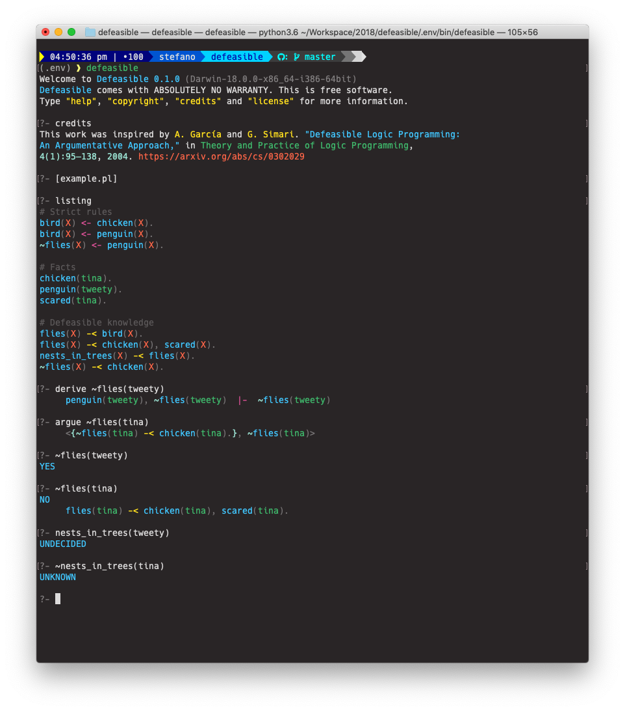
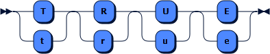
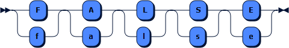
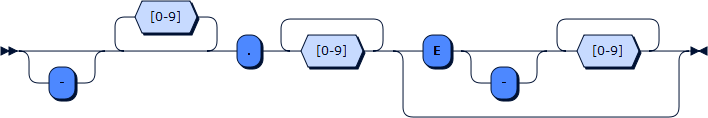
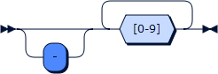
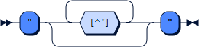
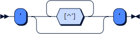
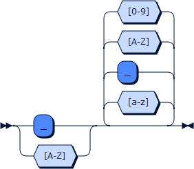
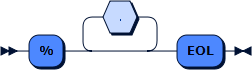

# DePYsible

___DePYsible___ is a Python implementation of [Defeasible Logic](https://en.wikipedia.org/wiki/Defeasible_logic) for [argumentation](https://en.wikipedia.org/wiki/Argumentation_theory).
In particular, _Defeasible Logic_ is a non-monotonic logic proposed to formalize defeasible reasoning and argumentation.

In a nutshell, _Defeasible Logic_ supports three types of propositions:

* __strict rules__: to specify known facts or information that is always a consequence of other sure facts,
* __defeasible rules__: to specify information that is typically or possibly a consequence of other information,
* __undercutting defeaters__: to specify exceptions to defeasible rules.

Some approaches like the one used in [this implementation](http://cs.uns.edu.ar/~ajg/papers/2004TPLPGarciaSimari.pdf), the _undercutting defeaters_ are derived by identifying the defeating __arguments__ among conflicting ones.
(An _argument_ relates to a fact called __conclusion__ and includes the list of defeasible rules that have to be true to make the _conclusion_ to hold.)

A priority ordering over the _defeasible rules_ and the _defeaters_ can be given or inferred by the __generalised specificity__ of the arguments. 
Intuitively, this comparison criterion favours two aspects: it prefers arguments (1) with greater information content or (2) with less use of rules (more direct).
In other words, given two conflicting arguments, the defeater is the more precise or more concise among them. 
Arguments that have the same generalised specificity can be ordered by means of user-specified priorities on the rules. 

During the process of deduction, the strict rules are always applied, while a defeasible rule can be applied only if no defeater of a higher priority specifies that it should not.
This process decides if each defeasible fact is _true_, _false_ or _undecided_ and provides the clues supporting these decisions.
 

## Example

    % Strict rules
    bird(X) <- chicken(X).
    bird(X) <- penguin(X).
    ~flies(X) <- penguin(X).
    
    % Facts
    chicken(tina).
    penguin(tweety).
    scared(tina).
    
    % Defeasible knowledge
    flies(X) -< bird(X).
    flies(X) -< chicken(X), scared(X).
    ~flies(X) -< chicken(X).
    nests_in_trees(X) -< flies(X).

## Obtaining DePYsible

### Prerequisites

___DePYsible___ is an application developed in _Python 3.6.5_ and requires __Python 3.6.x (or later)__ to run.
A more recent version of _Python_ for your working environment, if needed, can be downloaded from the [official Python website](https://www.python.org).

It is possible to use a virtual environment and install _DePYsible_ in a sandbox into a user directory. 
__Virtualenv__ is possibly the most popular tool to create isolated Python environments. 
Assuming that _Python 3.6.x (or later)_ has been successfully installed, _Virtualenv_ can be installed globally by running on a command line:

    pip install virtualenv

The instructions to create a virtual environment can be found [below](#compiling-depysible).
Assuming that a virtual environment is available in a folder named `.env`, it is activated by:

    source ./.env/bin/activate

and deactivated by running:

    deactivate

### Obtaining DePYsible

__DePYsible__'s sources can be downloaded from [github.com/stefano-bragaglia/DePYsible.git](https://github.com/stefano-bragaglia/DePYsiblePython.git).

Alternatively, they can be cloned by issuing the following command on your terminal:

    git clone https://github.com/stefano-bragaglia/DePYsible.git ./depysible

The interpreter might soon become available on [pypi.org](https://pypi.org) too.
Once available, it will be possible to installing it in the current _virtual_ (or _global_) _Python environment_ (see [above](#prerequisites)) with:

    pip install DePYsible 

### Compiling DePYsible

If __DePYsible__ has been installed as a package on a _virtual_ (or _global_) _Python environment_, the compiling is not required.
Otherwise compiling is mandatory, but _DePYsible_ supports [PyBuilder](http://pybuilder.github.io) which simplifies this step.

Assuming that _Python 3.6.x_ (or later)_ and _Virtualenv_ are already installed (see [here](#prerequisites)), it's highly recommended to create a local virtual environment by running:

    cd ./depysible
    virtualenv --python=python3.6 .env

The next step consists in installing _PyBuilder_ in the local virtual environment after having activated it:

    source ./.env/bin/activate
    pip install pybuilder
    
_PyBuilder_ is a build automation tool automates all the repetitive operations during the life cycle of the application such as installing the dependencies, testing the sources, compiling the sources, etc.
In order to compile and install _DePYsible_, run the following commands:

    pyb install_dependencies
    pyb clean analyze publish
    
And eventually:

    pip install ./target/dist/depysible-0.1.0/dist/depysible-0-1-0.tar.tgz
    
to install the compiled _DePYsible_ package into the local virtual environment.

From now on, any time the local virtual enviroment is activated, the command `depysible` becomes available on the command line.

## Running DePYsible

#### Configuring DePYsible

Environment variable for editing.

#### Running DePYsible

Heu, rusticus amor! Accentor de emeritis aonides, anhelare elevatus! 
Emeritis, albus itineris tramitems semper quaestio de magnum, placidus imber.
Brevis ollas ducunt ad homo. Orexiss sunt rectors de mirabilis lanista. A falsis, absolutio nobilis cobaltum.

##### Command line parameters

Heu, rusticus amor! Accentor de emeritis aonides, anhelare elevatus! 
Emeritis, albus itineris tramitems semper quaestio de magnum, placidus imber.
Brevis ollas ducunt ad homo. Orexiss sunt rectors de mirabilis lanista. A falsis, absolutio nobilis cobaltum.

##### Command line interface

Heu, rusticus amor! Accentor de emeritis aonides, anhelare elevatus! 
Emeritis, albus itineris tramitems semper quaestio de magnum, placidus imber.
Brevis ollas ducunt ad homo. Orexiss sunt rectors de mirabilis lanista. A falsis, absolutio nobilis cobaltum.

## The Language

The minimal bit of information in __Defeasible Logic__ is the ___atom___.
Each _atom_ consists of a ___functor___ and a possibly empty list of ___terms___.
The number of terms is known as the ___arity___ of the atom (if no term is specified, the arity of the atom is zero).
A _functor_ is either an ___identifier___ (a sequence of alphanumeric characters beginning with a lowercase letter) or a ___string___.
Notice that a _string_ is any sequence of characters enclosed in either ___double quotes___ or ___single quotes___.
The following, for example, are all valid atoms (and their arities): `atom` (0), `"STILL AN ATOM"` (0), `parent_of(homer, bart)` (2), `'has age'(bart, 10)` (2).

This implementation of __Defeasible Logic__ supports ___strong negation___ (symbol: `~`).
Given an atom (i.e.: `sky(blue)`), its _strong negation_ consists in its ___complement___ (`~sky(blue)`).
From a practical point of view, a _complement_ is treated as a new atom that is false if the original atom is true, and vice versa.
_Strong negation_ should not be confused with ___negation as failure___ (or _default negation_ ⎯ currently not implemented).
From now on, we will refer to an _atom_ or its _complement_ as a __literal__.

> ###### On negation 
> _Negation as failure_, in fact, allows to consider something true if it is not possible to derive its complement from the context.
> Generally speaking, _negation as failure_ is more powerful as it allows to deduce the truth value of an atom even though if it is not already available.
> _Strong negation_, however, is more conservative since it only allows to consider an atom true or false if it is defined as such, and makes no assumptions otherwise.
> The difference between the two kinds of negations it's similar to the difference between the inference in [open-world](https://en.wikipedia.org/wiki/Open-world_assumption) and [close-world assumption](https://en.wikipedia.org/wiki/Closed-world_assumption).       

_Literals_ can be combined together to form more expressive structures. 
___Rules___ (or _clauses_), in particular, consists of two sequences of literals called respectively ___head___ and ___body___ connected by the entailment symbol `:-` (read _if_).
The meaning of these structures is that when all the literals in the _body_ hold, then the literals in the _head_ can be considered true.
In [first-order logic](https://en.wikipedia.org/wiki/First-order_logic), the _heads_ usually consist of _1 literal_ and the _bodies_ of _0 or more literals_.
The following rules are hence all valid:

    grandparent_of(X, Y) :- parent_of(X, Z), parent_of(Z, Y).
    
    parent_of(abe, homer).
    parent_of(homer, bart).

In [Defeasible Logic](https://en.wikipedia.org/wiki/Defeasible_logic), however, there are two kinds of _rules_: ___strict___ and ___defeasible___.

A ___strict rule___ uses `<-` as entailment symbol and is a strong implication of the head from its body (_the head is true if the body holds_). 
A _strict rule_ with an empty body is called ___fact___ (the entailment symbol might be omitted).
The above example then becomes:

    grandparent_of(X, Y) <- parent_of(X, Z), parent_of(Z, Y). 
    
    parent_of(abe, homer). 
    parent_of(homer, bart). 

A ___defeasible rule___, instead, is a possible weak implication of the head from its body that can be proved wrong (_the head os presumably true if the body holds_) and uses `-<` as entailment symbol.
A ___defeasible rule___ with an empty body is called ___presumption___ (the entailment symbol can _not__ be omitted ti distinguish _presumptions_ from _facts_ ⎯ currently not supported anyway).

    is_alias(X, Y) -< in_place(X, P, T), ~in_place(Y, P, T).
    
    in_place(wayne, mansion, night).  ~in_place(wayne, streets, night).  ~in_place(wayne, offices, night).  ~in_place(wayne, batcave, night).
    in_place(wayne, offices, day).    ~in_place(wayne, streets, day).    ~in_place(wayne, mansion, day).    ~in_place(wayne, batcave, day).
    
    in_place(batman, streets, night). ~in_place(batman, mansion, night). ~in_place(batman, offices, night). ~in_place(batman, batcave, night).
    in_place(batman, batcave, day).   ~in_place(batman, streets, day).   ~in_place(batman, mansion, day).   ~in_place(batman, offices, day).
        
A ___defeasible (logic) program___ is a possibly infinite set of _facts_, _strict rules_ and _defeasible rules_.
_Defeasible programs_ are also denoted as (𝛱, 𝛥) where 𝛱 is the subset of _facts_ and _strict rules_ and 𝛥 the subset of _defeasible rules_ of the problem.
A _defeasible program_ is ___schematic___ if at least one of its _rules_ contain _variables_, otherwise it is said to be ___ground___.

The procedure for defeasible reasoning in this system assumes that _programs_ to be _ground_.

## The Grammar

    program      ::= rule* 'EOF'
    rule         ::= defeasible | strict 
    defeasible   ::= literal '-<' literals? salience? '.'
    strict       ::= literal ( '<-' literals? )? salience? '.'
    literals     ::= literal ( ',' literal )*
    literal      ::= negation? atom
    negation     ::= '~'+
    atom         ::= functor ( '(' terms? ')' )?
    functor      ::= DOUBLE_QUOTE | SINGLE_QUOTE | IDENTIFIER
    terms        ::= term ( ',' term )*
    term         ::= boolean | number | string | IDENTIFIER | VARIABLE
    boolean      ::= TRUE | FALSE
    number       ::= REAL | INTEGER
    string       ::= DOUBLE_QUOTE | SINGLE_QUOTE
    salience     ::= '@' INTEGER

    TRUE         ::= [Tt] [Rr] [Uu] [Ee]
    FALSE        ::= [Ff] [Aa] [Ll] [Ss] [Ee]
    REAL         ::= '-'? [0-9]* '.' [0-9]+ ('E' '-'? [0-9]+)?
    INTEGER      ::= '-'? [0-9]+
    DOUBLE_QUOTE ::= '"' [^"]* '"'
    SINGLE_QUOTE ::= "'" [^']* "'"
    IDENTIFIER   ::= [a-z][a-z_A-Z0-9]*
    VARIABLE     ::= [_A-Z][a-z_A-Z0-9]*
    
    COMMENT      ::= '%' .* 'EOL'

### program

    program  ::= rule* 'EOF'

no references

### rule

    rule     ::= defeasible
               | strict

referenced by:
* [program](#program)

### defeasible

    defeasible
             ::= literal '-<' literals? salience? '.'

referenced by:
* [rule](#rule)

### strict

    strict   ::= literal ( '<-' literals? )? salience? '.'

referenced by:
* [rule](#rule)

### literals

    literals ::= literal ( ',' literal )*

referenced by:
* [defeasible](#defeasible)
* [strict](#strict)

### literal

    literal  ::= negation? atom

referenced by:
* [defeasible](#defeasible)
* [literals](#literals)
* [strict](#strict)

### negation

    negation ::= '~'+

referenced by:
* [literal](#literal)

### atom

    atom     ::= functor ( '(' terms? ')' )?

referenced by:
* [literal](#literal)

### functor

    functor  ::= DOUBLE_QUOTE
               | SINGLE_QUOTE
               | IDENTIFIER

referenced by:
* [atom](#atom)

### terms

    terms    ::= term ( ',' term )*

referenced by:
* [atom](#atom)

### term

    term     ::= boolean
               | number
               | string
               | IDENTIFIER
               | VARIABLE

referenced by:
* [terms](#terms)

### boolean

    boolean  ::= TRUE
               | FALSE

referenced by:
* [term](#term)

### number

    number   ::= REAL
               | INTEGER

referenced by:
* [term](#term)

### string

    string   ::= DOUBLE_QUOTE
               | SINGLE_QUOTE

referenced by:
* [term](#term)

### salience

    salience ::= '@' INTEGER

referenced by:
* [defeasible](#defeasible)
* [strict](#strict)

### TRUE

    TRUE     ::= [Tt] [Rr] [Uu] [Ee]

referenced by:
* [boolean](#boolean)

### FALSE

    FALSE    ::= [Ff] [Aa] [Ll] [Ss] [Ee]

referenced by:
* [boolean](#boolean)

### REAL

    REAL     ::= '-'? [0-9]* '.' [0-9]+ ( 'E' '-'? [0-9]+ )?

referenced by:
* [number](#number)

### INTEGER

    INTEGER  ::= '-'? [0-9]+

referenced by:
* [number](#number)
* [salience](#salience)

### DOUBLE_QUOTE

    DOUBLE_QUOTE 
             ::= "'" [^']* "'"

referenced by:
* [functor](#functor)
* [string](#string)

### SINGLE_QUOTE

    SINGLE_QUOTE 
             ::= '"' [^"]* '"'

referenced by:
* [functor](#functor)
* [string](#string)

### IDENTIFIER

    IDENTIFIER 
             ::= [a-z] [a-z_A-Z0-9]*

referenced by:
* [functor](#functor)
* [term](#term)

### VARIABLE

    VARIABLE ::= [_A-Z] [a-z_A-Z0-9]*

referenced by:
* [term](#term)

### COMMENT

    COMMENT  ::= '%' .* 'EOL'

no references

## Grounding Problems

The procedure for querying ___Defeasible Logic programs___ described in [Garciía and Simari](http://cs.uns.edu.ar/~ajg/papers/2004TPLPGarciaSimari.pdf) requires the problems to be _ground_.
The authors suggest to use the ___Lifschitz convention___ to turn a ___schematic problem___ into a ___ground___ one.
This implementation uses a simplified forward-chaining rule-based engine implementing the [Rete algorithm](https://en.wikipedia.org/wiki/Rete_algorithm).

The engine builds a reticulate of 

## Future Works

Include _presumptions_, _negation_as_failure_ (standard negation) and _concordance_ check.

[//]: # "## Contributing"

[//]: # "Bug reports and pull requests are welcome on GitHub at [twitterz.api](https://github.com/stefano-bragaglia/DefeasiblePython) repository."
[//]: # "This project is intended to be a safe, welcoming space for collaboration, and contributors are expected to adhere to the" 
[//]: # "[Contributor Covenant](http://contributor-covenant.org) code of conduct."

## License

The project is covered by the [Simplified BSD license](https://opensource.org/licenses/BSD-2-Clause). 
