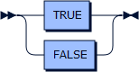

# DefeasiblePython

An implementation of Defeasible Logic in Python

[//]: # "## Contributing"

[//]: # "Bug reports and pull requests are welcome on GitHub at [twitterz.api](https://github.com/stefano-bragaglia/DefeasiblePython) repository."
[//]: # "This project is intended to be a safe, welcoming space for collaboration, and contributors are expected to adhere to the" 
[//]: # "[Contributor Covenant](http://contributor-covenant.org) code of conduct."

### Grammar

    program      ::= rule* 'EOF'
    rule         ::= defeasible | strict 
    defeasible   ::= literal '-<' literals? salience? '.'
    strict       ::= literal ( '<-' literals? )? salience? '.'
    literals     ::= literal ( ',' literal )*
    literal      ::= negation? atom
    negation     ::= '~'+
    atom         ::= functor ( '(' terms? ')' )?
    functor      ::= DOUBLE_QUOTE | SINGLE_QUOTE | IDENTIFIER
    terms        ::= term ( ',' term )*
    term         ::= boolean | number | string | IDENTIFIER | VARIABLE
    boolean      ::= TRUE | FALSE
    number       ::= REAL | INTEGER
    string       ::= DOUBLE_QUOTE | SINGLE_QUOTE
    salience     ::= '@' INTEGER

    TRUE         ::= [Tt] [Rr] [Uu] [Ee]
    FALSE        ::= [Ff] [Aa] [Ll] [Ss] [Ee]
    REAL         ::= '-'? [0-9]* '.' [0-9]+ ('E' '-'? [0-9]+)?
    INTEGER      ::= '-'? [0-9]+
    DOUBLE_QUOTE ::= '"' [^"]* '"'
    SINGLE_QUOTE ::= "'" [^']* "'"
    IDENTIFIER   ::= [a-z][a-z_A-Z0-9]*
    VARIABLE     ::= [_A-Z][a-z_A-Z0-9]*
    COMMENT      ::= '%' .* 'EOL'

#### program

    program  ::= rule* 'EOF'

no references

#### rule

    rule     ::= defeasible
               | strict

referenced by:
* [program](#program)

#### defeasible

    defeasible
             ::= literal '-<' literals? salience? '.'

referenced by:
* [rule](#rule)

#### strict

    strict   ::= literal ( '<-' literals? )? salience? '.'

referenced by:
* [rule](#rule)

#### literals

    literals ::= literal ( ',' literal )*

referenced by:
* [defeasible](#defeasible)
* [strict](#strict)

#### literal

    literal  ::= negation? atom

referenced by:
* [defeasible](#defeasible)
* [literals](#literals)
* [strict](#strict)

#### negation

    negation ::= '~'+

referenced by:
* [literal](#literal)

#### atom

    atom     ::= functor ( '(' terms? ')' )?

referenced by:
* [literal](#literal)

#### functor

    functor  ::= DOUBLE_QUOTE
               | SINGLE_QUOTE
               | IDENTIFIER

referenced by:
* [atom](#atom)

#### terms

    terms    ::= term ( ',' term )*

referenced by:
* [atom](#atom)

#### term

    term     ::= boolean
               | number
               | string
               | IDENTIFIER
               | VARIABLE

referenced by:
* [terms](#terms)

#### boolean

    boolean  ::= TRUE
               | FALSE

referenced by:
* [term](#term)

#### number

    number   ::= REAL
               | INTEGER

referenced by:
* [term](#term)

#### string

    string   ::= DOUBLE_QUOTE
               | SINGLE_QUOTE

referenced by:
* [term](#term)

### Future Works

Include _presumptions_, _negation_as_failure_ (standard negation) and _concordance_ check.

### License

The project is covered by the [Simplified BSD license](https://opensource.org/licenses/BSD-2-Clause). 
