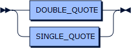
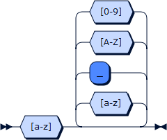

# DefeasiblePython

An implementation of Defeasible Logic in Python

The problems in defeasible logic are expressed in first order logic.

The minimal bit of information in __Defeasible Logic__ is the ___atom___.
Each _atom_ consists of a ___functor___ and a possibly empty list of ___terms___.
The number of terms is known as the ___arity___ of the atom (if no term is specified, the arity of the atom is zero).
A _functor_ is either an ___identifier___ (a sequence of alphanumeric characters beginning with a lowercase letter) or a ___string___.
Notice that a _string_ is any sequence of characters enclosed in either ___double quotes___ or ___single quotes___.
The following, for example, are all valid atoms (and their arities): `atom` (0), `"STILL AN ATOM"` (0), `parent_of(homer, bart)` (2), `'has age'(bart, 10)` (2).

This implementation of __Defeasible Logic__ supports ___strong negation___ (symbol: `~`).
Given an atom (i.e.: `sky(blue)`), its _strong negation_ consists in its ___complement___ (`~sky(blue)`).
From a practical point of view, a _complement_ is treated as a new atom that is false if the original atom is true, and vice versa.
_Strong negation_ should not be confused with ___negation as failure___ (or _default negation_; currently not implemented).
From now on, we will refer to an _atom_ or its _complement_ as a __literal__.

> ###### On negation 
> _Negation as failure_, in fact, allows to consider something true if it is not possible to derive its complement from the context.
> Generally speaking, _negation as failure_ is more powerful as it allows to deduce the truth value of an atom even though if it is not already available.
> _Strong negation_, however, is more conservative since it only allows to consider an atom true or false if it is defined as such, and makes no assumptions otherwise.
> The difference between the two kinds of negations it's similar to the difference between the inference in [open-world](https://en.wikipedia.org/wiki/Open-world_assumption) and [close-world assumption](https://en.wikipedia.org/wiki/Closed-world_assumption).       

_Literals_ can be combined together to form more expressive structures. 
___Rules___ (or _clauses_), in particular, consists of two sequences of literals called respectively ___head___ and ___body___ connected by the entailment symbol `:-` (read _if_).
The meaning of these structures is that when all the literals in the _body_ hold, then the literals in the _head_ can be considered true.
In [first-order logic](https://en.wikipedia.org/wiki/First-order_logic), the _heads_ usually consist of _1 literal_ and the _bodies_ of _0 or more literals_.
The following rules are hence all valid:

    grandparent_of(X, Y) :- parent_of(X, Z), parent_of(Z, Y).
    
    parent_of(abe, homer).
    parent_of(homer, bart).

In [Defeasible Logic](https://en.wikipedia.org/wiki/Defeasible_logic), however, there are two kinds of _rules_: ___strict___ and ___defeasible___.

A ___strict rule___ uses `<-` as entailment symbol and is a strong implication of a head from its body (_head if body_). 
A _strict rule_ with an empty body is called ___fact___ (the entailment symbol might be omitted).
The above example then becomes:

    grandparent_of(X, Y) <- parent_of(X, Z), parent_of(Z, Y). 
    % A strict rule, to be read as: 
    % X is grandparent of Y if X parent of Z and Z parent of Y 
    
    parent_of(abe, homer). parent_of(homer, bart). 
    % Some facts

A ___defeasible rule___, instead, is a possible weak implication of a head from its body that can be proved wrong (_presumably head if body_) and uses `-<` as entailment symbol.
A ___defeasible rule___ with an empty body is called ___presumption___ (the entailment symbol can not be omitted) [ReadME] [1].

Observation 4.1
If n = 1, the body is empty but the head is not a fact but a presumption.
Presumptions require the symbol for deasible implication to explicitly set them apart from facts:
b -: .       (read as there are defeasible reasons to believe in b)

## Grammar

    program      ::= rule* 'EOF'
    rule         ::= defeasible | strict 
    defeasible   ::= literal '-<' literals? salience? '.'
    strict       ::= literal ( '<-' literals? )? salience? '.'
    literals     ::= literal ( ',' literal )*
    literal      ::= negation? atom
    negation     ::= '~'+
    atom         ::= functor ( '(' terms? ')' )?
    functor      ::= DOUBLE_QUOTE | SINGLE_QUOTE | IDENTIFIER
    terms        ::= term ( ',' term )*
    term         ::= boolean | number | string | IDENTIFIER | VARIABLE
    boolean      ::= TRUE | FALSE
    number       ::= REAL | INTEGER
    string       ::= DOUBLE_QUOTE | SINGLE_QUOTE
    salience     ::= '@' INTEGER

    TRUE         ::= [Tt] [Rr] [Uu] [Ee]
    FALSE        ::= [Ff] [Aa] [Ll] [Ss] [Ee]
    REAL         ::= '-'? [0-9]* '.' [0-9]+ ('E' '-'? [0-9]+)?
    INTEGER      ::= '-'? [0-9]+
    DOUBLE_QUOTE ::= '"' [^"]* '"'
    SINGLE_QUOTE ::= "'" [^']* "'"
    IDENTIFIER   ::= [a-z][a-z_A-Z0-9]*
    VARIABLE     ::= [_A-Z][a-z_A-Z0-9]*
    
    COMMENT      ::= '%' .* 'EOL'

### program

    program  ::= rule* 'EOF'

no references

### rule

    rule     ::= defeasible
               | strict

referenced by:
* [program](#program)

### defeasible

    defeasible
             ::= literal '-<' literals? salience? '.'

referenced by:
* [rule](#rule)

### strict

    strict   ::= literal ( '<-' literals? )? salience? '.'

referenced by:
* [rule](#rule)

### literals

    literals ::= literal ( ',' literal )*

referenced by:
* [defeasible](#defeasible)
* [strict](#strict)

### literal

    literal  ::= negation? atom

referenced by:
* [defeasible](#defeasible)
* [literals](#literals)
* [strict](#strict)

### negation

    negation ::= '~'+

referenced by:
* [literal](#literal)

### atom

    atom     ::= functor ( '(' terms? ')' )?

referenced by:
* [literal](#literal)

### functor

    functor  ::= DOUBLE_QUOTE
               | SINGLE_QUOTE
               | IDENTIFIER

referenced by:
* [atom](#atom)

### terms

    terms    ::= term ( ',' term )*

referenced by:
* [atom](#atom)

### term

    term     ::= boolean
               | number
               | string
               | IDENTIFIER
               | VARIABLE

referenced by:
* [terms](#terms)

### boolean

    boolean  ::= TRUE
               | FALSE

referenced by:
* [term](#term)

### number

    number   ::= REAL
               | INTEGER

referenced by:
* [term](#term)

### string

    string   ::= DOUBLE_QUOTE
               | SINGLE_QUOTE

referenced by:
* [term](#term)

### salience

    salience ::= '@' INTEGER

referenced by:
* [defeasible](#defeasible)
* [strict](#strict)

### TRUE

    TRUE     ::= [Tt] [Rr] [Uu] [Ee]

referenced by:
* [boolean](#boolean)

### FALSE

    FALSE    ::= [Ff] [Aa] [Ll] [Ss] [Ee]

referenced by:
* [boolean](#boolean)

### REAL

    REAL     ::= '-'? [0-9]* '.' [0-9]+ ( 'E' '-'? [0-9]+ )?

referenced by:
* [number](#number)

### INTEGER

    INTEGER  ::= '-'? [0-9]+

referenced by:
* [number](#number)
* [salience](#salience)

### DOUBLE_QUOTE

    DOUBLE_QUOTE 
             ::= "'" [^']* "'"

referenced by:
* [functor](#functor)
* [string](#string)

### SINGLE_QUOTE

    SINGLE_QUOTE 
             ::= '"' [^"]* '"'

referenced by:
* [functor](#functor)
* [string](#string)

### IDENTIFIER

    IDENTIFIER 
             ::= [a-z] [a-z_A-Z0-9]*

referenced by:
* [functor](#functor)
* [term](#term)

### VARIABLE

    VARIABLE ::= [_A-Z] [a-z_A-Z0-9]*

referenced by:
* [term](#term)

### COMMENT

    COMMENT  ::= '%' .* 'EOL'

no references

## Future Works

Include _presumptions_, _negation_as_failure_ (standard negation) and _concordance_ check.

[//]: # "## Contributing"

[//]: # "Bug reports and pull requests are welcome on GitHub at [twitterz.api](https://github.com/stefano-bragaglia/DefeasiblePython) repository."
[//]: # "This project is intended to be a safe, welcoming space for collaboration, and contributors are expected to adhere to the" 
[//]: # "[Contributor Covenant](http://contributor-covenant.org) code of conduct."

## License

The project is covered by the [Simplified BSD license](https://opensource.org/licenses/BSD-2-Clause). 

[1]: Presumptions are not currently supported.